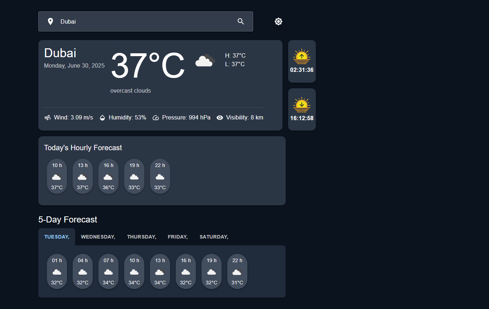
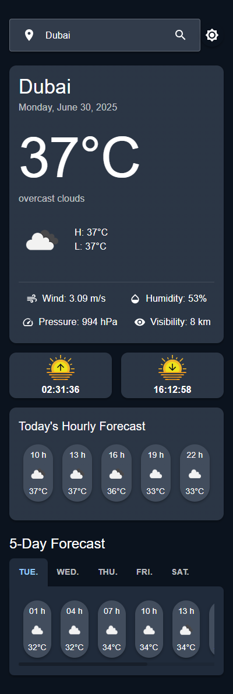

# 🌦️ Weather Forecast App

> A beautiful, responsive weather application built with React and Material UI that provides real-time weather data and forecasts for any location worldwide.
---
## 📷 Screenshots

 
---

## ✨ Features

- **Current Weather Conditions**: Temperature, humidity, wind speed, pressure, and visibility
- **Detailed Forecasts**: Hourly and 5-day forecasts with visual icons
- **Sunrise/Sunset Times**: With intuitive visual indicators
- **Location Services**: Search by city or use your current location
- **Dark/Light Mode**: Toggle between themes for comfortable viewing
- **Responsive Design**: Works on mobile, tablet, and desktop
---
## 🚀 Quick Start

1. **Clone the repository**
   ```bash
   git clone https://github.com/abdallahsekrafi/weather-app.git
   cd weather-app
2. **Install dependencies**
   ```bash
   npm install
2. **Run the development server**
   ```bash
   npm run dev
---

## 🛠️ Project Structuree

The entire application is contained in a single file (App.js) with these components:
- Main App: Manages state and theme
- Weather Components:
  -- CurrentWeather - Shows current conditions
  -- HourlyForecast - Displays today's hourly forecast
  -- DailyForecast - 5-day forecast with tab navigation
- UI Components:
  -- SearchBar - City search with geolocation
  -- ThemeToggle - Dark/light mode switch
  -- WeatherDetails - Weather metrics display
  -- HourlyForecastItem - Individual forecast cards
---

## 📚 API Usage
    Current weather
     >>> axios.get(`https://api.openweathermap.org/data/2.5/weather?q=${location}&units=metric&appid=${API_KEY}`)
    5-day forecast
    >>> axios.get(`https://api.openweathermap.org/data/2.5/forecast?q=${location}&units=metric&appid=${API_KEY}`)
---

## 🎨 Design System

- Themes: Custom light and dark themes using Material UI
- Layout: Card-based design with responsive grid
- Icons: Material Icons + Weather condition icons from OpenWeather
- Typography: Consistent typography scale throughout
---

## 💼 Technologies Used

<div align="left">
  
  
  
  
  
  
  
</div>
---

## 📦 Dependencies

| Package      | Version     | Purpose            |
|-------------------|---------|-----------------------|
| @mui/material	| ^5.0.0	| UI Components
|-------------------|---------|-----------------------|
| @mui/icons-material	| ^5.0.0	| Icons
|-------------------|---------|-----------------------|
| axios	| ^1.0.0	| HTTP requests
|-------------------|---------|-----------------------|
| react	| ^18.0.0	| Core framework
|-------------------|---------|-----------------------|
| react-dom	| ^18.0.0	| DOM rendering
---

## 🌐 Browser Support

- Chrome (latest)
- Firefox (latest)
- Edge (latest)
- Safari (latest)
- Mobile Safari (iOS)
- Chrome for Android
---

## 🤝 Contributing

- Fork the project
- Create your feature branch (git checkout -b feature/AmazingFeature)
- Commit your changes (git commit -m 'Add some AmazingFeature')
- Push to the branch (git push origin feature/AmazingFeature)
- Open a Pull Request
---

## 📬 Contact

- **LinkedIn**: [Abdallah Sekrafi](https://www.linkedin.com/in/abdallah-sekrafi-47232889/)
- **Facebook**: [fb.com/abdallah.sek](https://www.facebook.com/abdallah.sek/)
- **GitHub**: [github.com/abdallahsekrafi](https://github.com/abdallahsekrafi)

---

## 🙏 Acknowledgments

- OpenWeather for their excellent free API
- Material UI team for the amazing component library
- All contributors who helped improve this project
---
## © Sekrafi Abdallah @ 2025
## 📜 License
This project is licensed under the MIT License.
